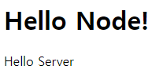

# HTTP

## GET과 POST

우리가 XMLHttpRequest를 사용 할 때 GET과 POST를 잠시 사용 해 보았습니다.

GET은 웹에서 필요한 정보를 서버에 조회 할 때 사용합니다.

POST는 웹에서 작성 된 정보를 서버로 전달 할 때 사용합니다.

만약 GET과 POST와 같이 역할을 나누지 않는다면 프론트엔드 개발자가 서버에 요청을 보낼 때 큰 혼란을 느낄 수 있습니다. 이를 방지하기 위해서 메소드 라는 것을 통해 어떤 역할을 하는지 미리 정의합니다.

GET과 POST이외에 다른 메소드와 상태 코드는 4장에서 추가적으로 배울 수 있습니다.

## HTTP 모듈

서버는 간단하게 생각해서 내 컴퓨터에서 HTTP 통신을 가능하게 설정하고, 통신이 들어왔을 때 필요한 연산 처리를 진행 한 후 결과값을 다시 통신으로 보내주면 됩니다.

Node.js는 이를 간단하게 처리 할 수 있도록 되어 있습니다.

서버 생성 코드

```javascript
const http = require("http");

http
  .createServer((req, res) => {
    res.write(`<h1>Hello Node!</h1>`);
    res.end(`<p>Hello Server</p>`);
  })
  .listen(8000, () => {
    console.log(`8000번 포트가 서버 대기중입니다!`);
  });
```

파일을 작성 한 후 터미널에서

```bash
node ./http.js

/// 실행
8000번 포트가 서버 대기중입니다!
```

이후 브라우저에서 "http://localhost:8000"으로 요청을 보내게 되면 아래와 같이 나옵니다.



이제 서버를 종료하고 싶으면

`Ctrl + c`를 눌러 탈출 하면 됩니다.
