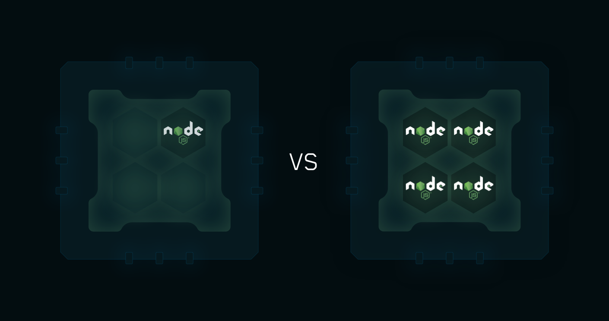

# cluster와 fork

cluster와 fork 둘 다 코드를 복사하여 자식 프로세스를 실행한다는 개념은 동일합니다.



즉 내가 만든 코드를 하나의 프로세서에서 구동 할 것인지, 여러개의 프로세서에서 동시에 구동 할 것인지에 대한 차이입니다.

다만 cluster와 fork의 차이점은 두가지가 있습니다.

1. 포트를 공유 할 것인지에 대한 유무
2. 로그밸런싱을 할 것인지에 대한 유무

첫번째로 포트를 공유 한다는 의미는 첫번째로 켜지는 서버의 경우 3000번 포트를 사용 한다면 두번 째로 켜지는 서버의 경우에는 이미 이를 사용하고 있기 때문에 포트를 점유하지 못하여 에러가 발생합니다.

fork_cluster 폴더에서 이를 테스트 해 볼 수 있는 예제가 있습니다.

먼저 fork.js를 보면 fork를 담당하는 node의 기본 모듈인 child_process를 불러온 후 fork를 chidl1과 child2 두번 server.js를 실행하는 것을 알수 있습니다.

```javascript
const { fork } = require("child_process");

const child1 = fork("./server.js", ["child"]);
child1.on("error", (err) => {
  console.log(`child1에서 에러가 발생 했습니다. ${err}`);
});

const child2 = fork("./server.js", ["child"]);
child2.on("error", (err) => {
  console.log(`child2에서 에러가 발생 했습니다. ${err}`);
});
```

하지만 두번째는 포트를 점유하지 못하여 에러가 발생하여 동작하지 않는 것을 알 수 있습니다.

cluster.js에서는 cluster를 담당하는 node의 기본 모듈인 cluster를 불러온 후 마스터 프로세스일 경우 자식 프로세스를 실행 시키기 위해 cluster.fork()를 두번 실행하여 자식 프로세스를 두개 만드는 것을 알 수 있으며, 자식 프로세스에서는 서버를 생성하는데 8080포트를 두개 공유하는 것을 알 수 있습니다.

여기서 처음보는 단어인 마스터 프로세스와 자식 프로세스에 대해서 간단히 설명 하자면 마스터 프로세스는 최초로 실행되는 스크립트로 추후 실행이 되는 자식 프로세스를 관리하고 관찰 하고 있습니다. 그러므로 자식 프로세스에서 본격적으로 Task(작업)을 수행하고 최초에는 부모 프로세스로 들어와서 특정 스케쥴에 따라 자식 프로세스로 작업이 분배 된다고 생각 하면 됩니다.


이러한 cluster 작업을 pm2에서 명령어를 기반으로 별도의 코딩 없이 실행 시킬 수 있습니다.
